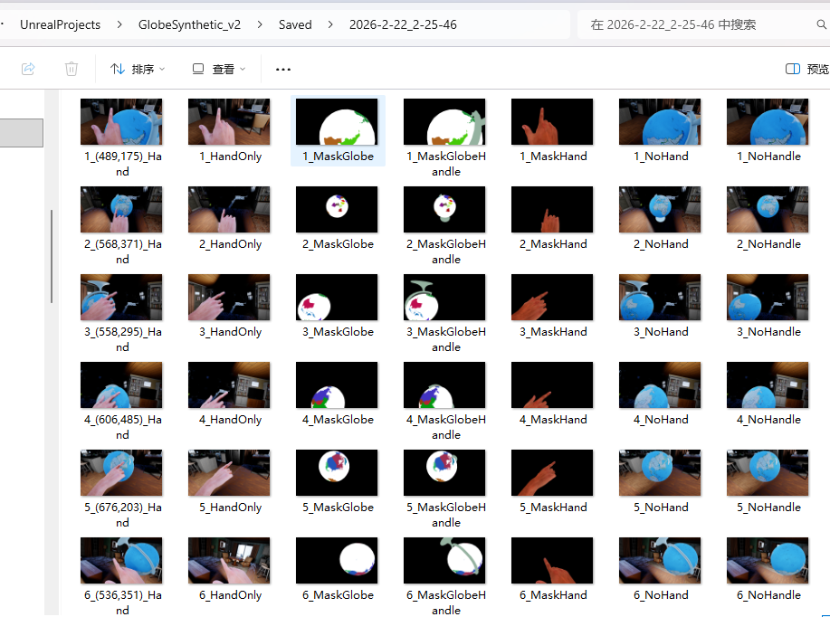
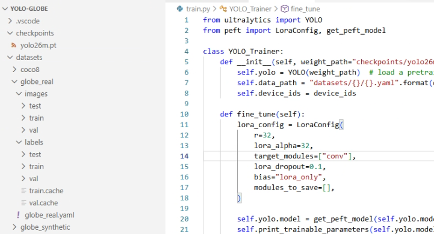
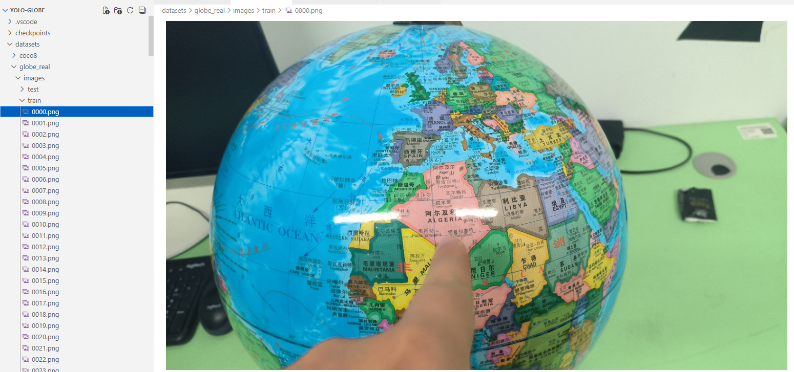

## YOLO-Globe

This project constructs an automated synthetic data generation pipeline using Unreal Engine 5 (UE5) (generating synthetic globe images + annotations). It employs YOLO26 for object detection, utilizes Sim-to-Real techniques to validate model performance, and applies LoRA fine-tuning to address issues regarding small objects (small countries) and edge distortions.

### 1. Data Preparation

The data sources are divided into real-world photography and virtual synthesis. The real-world part was captured using mobile phones and is omitted here; the virtual part was generated using UE5 through scene transformations and viewport component screenshots. The relevant project files can be downloaded from the cloud drive. The UE5 version used is 5.4.

Link: https://pan.baidu.com/s/1ZeXob0uif4bUi0tH5CXgXA?pwd=sbqs  
Password: sbqs

After entering the scene and running it, press the __P__ key to start automatic screenshots. The generated image results are shown below.

The generated data includes images and annotations. The annotations need to be converted via a Python script into a format compatible with the __ultralytics__ library. The processing script is: __make_yolo_dataset.py__

The directory structure for real and synthetic datasets is as follows, which can also be found in the official __ultralytics__ documentation.

Sample images and annotations are shown below:

The background for data augmentation uses the __COCO2017__ dataset.

Download links are as follows:

http://images.cocodataset.org/zips/train2017.zip
http://images.cocodataset.org/zips/test2017.zip
http://images.cocodataset.org/zips/val2017.zip

### 2. Model Training

Training of the YOLO series models relies on the __ultralytics__ library. First, download the YOLO26 weights into the __checkpoints__ folder. The default model weight used is __yolo26m.pt__.

You can download weight here: https://docs.ultralytics.com/zh/models/yolo26/

After configuring the data and weights, run __train.py__ to start training.

This script also includes a fine-tuning implementation based on the __peft__ library, specifically utilizing LoRA for bypass fine-tuning of the convolutional layers in YOLO26.

Results are stored in the __run__ folder.

### 3. Others

The tool used for annotating real-world data is __vott__.

The paper is currently under submission. More detailed information regarding weights, data, etc., will be released upon acceptance.